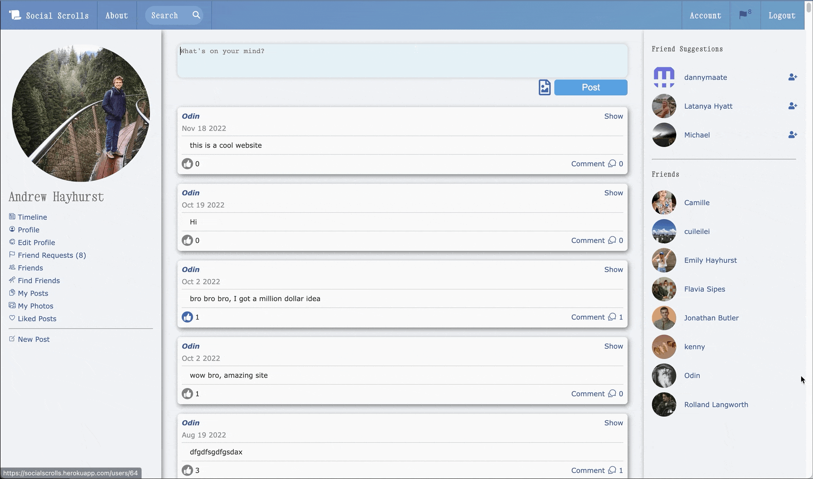
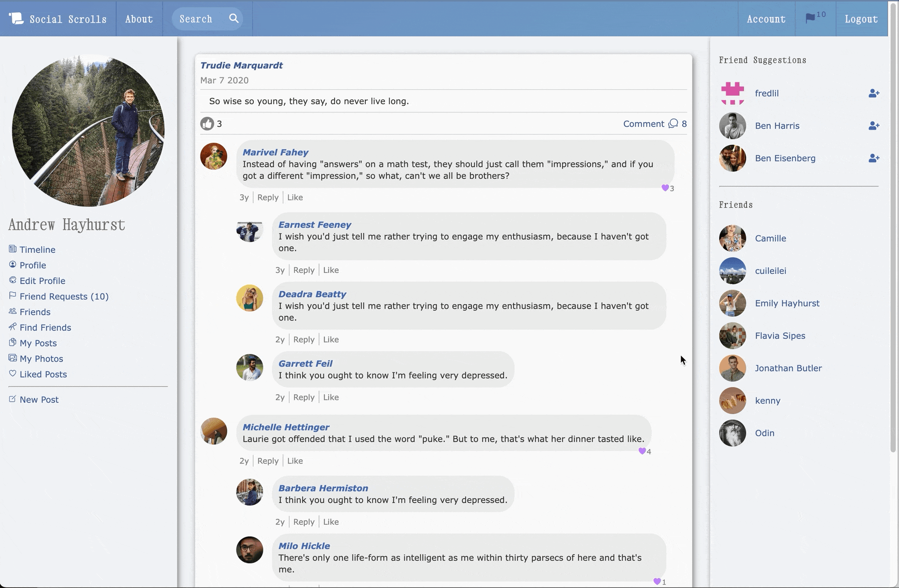

# Social Scrolls

Like Facebook, but without the baggage.

---

Users can create posts, upload pictures, manage friends and friend requests, like comments/posts, comment on comments/posts, search for friends or website content, and navigate to their personalized pages:

- Timeline

- Personal Posts

- Personal Photos

- Liked Posts

Users can login or sign up with Facebook, Github, or an email address, and edit their accounts and profiles. Confirmation emails are sent to new users when they sign up.

---

OmniAuth is implemented for Facebook and Github. Active Storage is used for avatar and photo uploads, using cloud storage on [Cloudinary](https://cloudinary.com/). Action Mailer is used with the default [Mail](https://github.com/mikel/mail) gem.

Test suite covers Models, Controllers, Mailers, and Integration Testing with Capybara.

---

Some screen recordings of Social Scrolls when it was still live, hosted on Heroku:

-Andrew Hayhurst